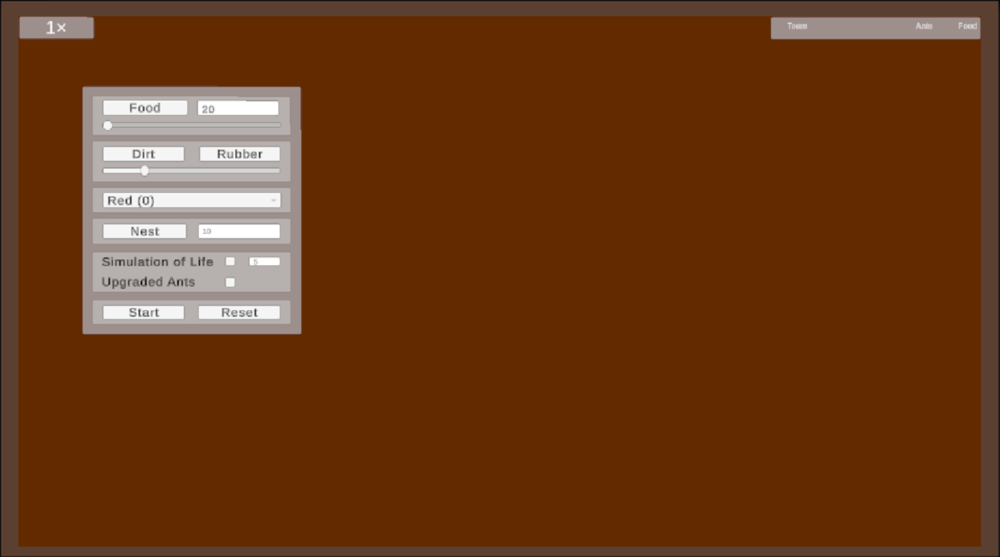

# Uživatelská dokumentace

## O projektu a očekávání

Cílem **Ant Colony** je nabídnout **sandbox**, ve kterém si postavíte vlastní mapu a podíváte se, jak si s ní poradí mravenci z různých týmů. Žádný mravenec nemá globální plán; řídí se směrem, náhodou, zbytkovými feromony a jednoduchými pravidly pro vyhýbání překážkám. Z těchto drobných interakcí vznikají **cesty**, **dopravní tepny** a pozoruhodné trendy kolonií.

Ant Colony je velmi přístupná. Nabízí:

* jednoduché ovládání pomocí myši a pár kláves,
* rychlé testování různých strategií,
* přehledné UI pro úpravu prostředí i pravidel hry.

---

## Herní módy

* **Editor mode** (výchozí): stavíte level – přidáváte **hnízda** a **spawner jídla**, kreslíte **Dirt** (překážky) a gumujete pomocí **Rubber**. Aktivní je panel editoru.
* **Simulation mode**: spustíte tlačítkem **Start**. Hnízda se aktivují, mravenci vyrazí, pokládají feromony a nosí jídlo domů. Editor se v tomto módu zamkne. Tlačítkem **Reset** kdykoli nahrajete scénu znovu.

---

## Editor

### Přehled UI

1. **Time Scaler** - V pravém horním rohu, po startu ukazuje, jak moc máme zrychlenou scénu.
2. **Food (řádek)** – vlevo aktivuje nástroj pro umístění *FoodSpawneru*; vpravo zadáte cílové množství jídla, které má nový spawner udržovat.
3. **Food (slider)** – jemné doladění stejné hodnoty. Slider je propojený s číselníkem, obojí se synchronizuje.
4. **Dirt / Rubber (řádek)** – vlevo *Dirt* kreslí překážky (kruhové segmenty s kolizí), vpravo *Rubber*, ten je maže.
5. **Dirt (slider)** – velikost „štětce“ pro Dirt/Rubber (lze měnit i kolečkem myši).
6. **Team (dropdown)** – určuje tým pro nově kladená hnízda (barvu i to, ke kterým feromonovým polím se připojí).
7. **Nest (řádek)** – vlevo tlačítko *Nest* umístí hnízdo; vpravo **Initial Agents**, kolik mravenců hnízdo dostane po startu.
8. **Simulation of Life** – nasbírané jídlo se přepočítává na nové mravence (poměr určuje **Food per new ant**, který se dá nastavit).
9. **Upgraded Ants** – nově narození mravenci získají **genom** (náhodné multiplikátory parametrů dle *Game Rules*).
10. **Start** – přepne z Editor mode do Simulation mode.
11. **Reset** – rychlý restart aktuální scény.

### Rychlé ovládání

* **Levé tlačítko myši** – provede akci vybraného nástroje, může i posouvat s objekty v editoru.
* **Tab** – schová/zobrazí panel editoru (přepíná se přímo panel, ne skript).
* **F** – přepíná viditelnost feromonů po týmech: **žádné → tým 0 → tým 1 → … → žádné**.
* **U/I** - Zpomalení/zrychlení siulace.

### Rychlý start

1. Vyberte **Nest** a klikněte do scény.
2. Přepněte na **Food** a přidejte **FoodSpawner**. Počet kousků jídla upravte přes řádek nebo slider.
3. Stiskněte **Start** a sledujte feromonové trasy. **Reset** scénu vrátí do výchozího stavu.

### Panel editoru a Game Rules

Můžete měnit:

* **Team** – přepínání barev a týmové příslušnosti nových hnízd,
* **Food Amount** – jak velký zásobník bude FoodSpawner doplňovat,
* **Nest Initial Agents** – kolik mravenců se narodí po spuštění,
* **Simulation of Life** – jídlo se přepočítá na nové agenty,
* **Upgraded Ants** – noví agenti mají „genetické variace“ (např. rychlost, síla).

### Nástroje a ovládání

* **Food** – umístí *FoodSpawner* generující jídlo.
* **Nest** – přidá hnízdo s danou barvou a počtem počátečních agentů.
* **Dirt** – přidává překážky (mravenci je obcházejí nebo po nich kloužou).
* **Rubber** – maže předchozí překážky.

---

## Skóre týmů

Panel **Scoreboard** vpravo nahoře ukazuje u každého týmu:

* **počet živých mravenců**,
* **celkové nasbírané jídlo**.

Lze jej přetahovat myší, velikost se přizpůsobí automaticky podle dat.

---

## Viditelnost feromonů

Stiskem **F** se cykluje zobrazení feromonů podle týmů:

* žádné,
* tým 0,
* tým 1,
* ...

Vizuálně zajišťuje *PheromoneField*, který ukazuje intenzitu a směr pomocí částic.

---

## Zrychlení simulace (Time Scale)

Pro rychlé testování můžete změnit rychlost celé simulace pomocí skriptu **TimeScaleHotkeys**.

* Ovlivňuje běh celé simulace.

---

