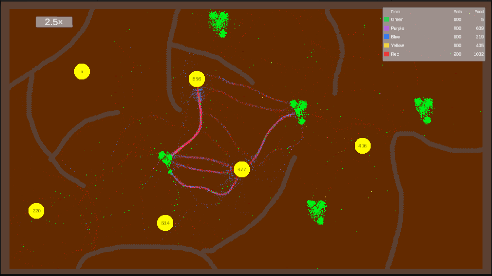

# Ant Colony Simulator

Tento projekt vznikl jako zápočtový program v rámci kurzu **Pokročilé programování v C#** na MFF UK.

* Autor: **Jakub Dvořák**

Cílem je vytvořit **simulátor mravenčí kolonie**, který demonstruje principy **emergentního chování**. Jednotliví mravenci se rozhodují pouze na základě **lokálních informací** (feromony, potrava, překážky, pozice hnízda), ale dohromady vytvářejí **globálně čitelné trasy a strategie**.

---

## Rychlý náhled
Vizuální ukázka běžící simulace:



---

##  Hlavní funkce

* **Hledání potravy** – mravenci prozkoumávají mapu a sbírají zdroje.
* **Feromonové stopy** – každý jedinec ukládá do prostředí feromon, který pomáhá ostatním zorientovat se.
* **Návrat do hnízda** – nasbíraná potrava je transportována zpět a zvyšuje skóre kolonie.
* **Více týmů** – simulace podporuje paralelní běh několika kolonií a porovnávání jejich chování.
* **Genom** – volitelné multiplikátory vlastností (rychlost, citlivost, difuze feromonů…), které umožňují vznik „plemen“ s odlišnými strategiemi.
* **Sandbox editor** – uživatel může kreslit mapu (hnízda, zdroje, překážky) a sledovat, jak si s ní kolonie poradí.

---

## Technologie

* **C#** + **Unity** (2D simulace s gridem i objekty)
* **Fluent API** pro konfiguraci genomu

---

## Struktura repozitáře

```
/DOCS
   ├─ user-guide.md        # Uživatelská dokumentace
   ├─ developer-guide.md   # Programátorská dokumentace
   ├─ diagrams/            # PlantUML diagramy
   └─ images/              # Obrázky
/AntColonySimulation       # Hlavní C# kód simulace
```

---

## Spuštění

1. Naklonuj si github repozitář
1. Otevři projekt v **Unity Hub**.
2. Spusť scénu.
3. V **Editor mode** můžeš upravovat mapu (hnízda, potrava, překážky).
4. V **Simulation mode** sleduj chování mravenců.

---

## Dokumentace

* **[Uživatelská dokumentace](DOCS/user-guide.md)** – návod k ovládání a používání simulace.
* **[Programátorská_dokumentace](DOCS/developer-guide.md)** – technické detaily.

---

## Přínos projektu

Simulátor ukazuje, jak z jednoduchých pravidel může vzniknout složité chování celého systému.