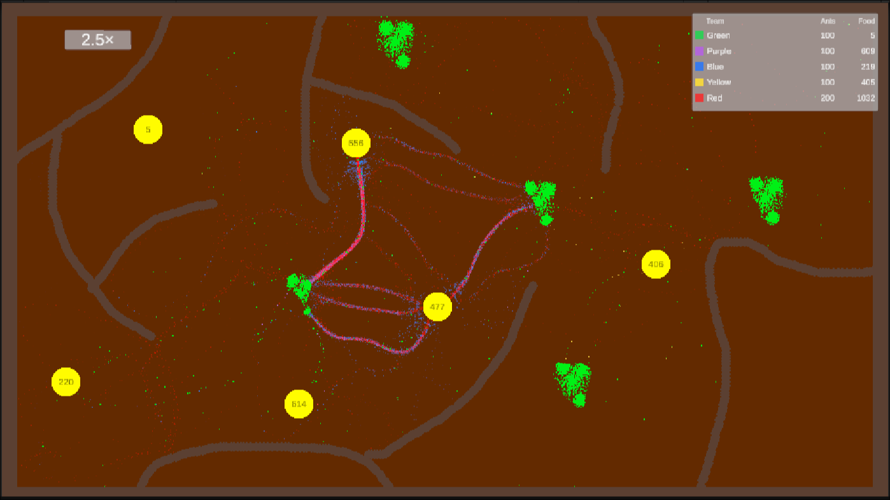

# Ant Colony Simulator

**A multi-colony ant foraging simulator in Unity/C#, built to watch global structure emerge
from purely local rules.** Every ant decides using only what it can sense where it stands —
pheromone concentration, food, obstacles, the direction of its nest — and no ant has a map.
Legible trails, route selection and competition between colonies are all emergent.



**Features.** Pheromone trails with diffusion and decay · a per-colony genome (speed, sensitivity,
deposition and diffusion multipliers) that lets distinct "strains" evolve different strategies ·
several colonies running in parallel for direct comparison · a sandbox editor for drawing maps
(nests, food, obstacles).

**Built with** C# and Unity (2D, grid + objects), with a fluent API for genome configuration.
Course project for *Advanced C# Programming* at MFF UK, Charles University.

**Docs.** [User guide](DOCS/user-guide.md) · [Developer guide](DOCS/developer-guide.md) — both in Czech,
with PlantUML architecture diagrams in [`DOCS/diagrams/`](DOCS/diagrams/).

**Run it.** Clone the repository, open it in Unity Hub, and play the scene. *Editor mode* lets you
draw the map; *Simulation mode* runs the colonies.

*Jakub Dvořák · [kubadvorak.com](https://kubadvorak.com)*

---

## Česky

# Ant Colony Simulator

Tento projekt vznikl jako zápočtový program v rámci kurzu **Pokročilé programování v C#** na MFF UK.

* Autor: **Jakub Dvořák**

Cílem je vytvořit **simulátor mravenčí kolonie**, který demonstruje principy **emergentního chování**. Jednotliví mravenci se rozhodují pouze na základě **lokálních informací** (feromony, potrava, překážky, pozice hnízda), ale dohromady vytvářejí **globálně čitelné trasy a strategie**.

---

## Rychlý náhled
Vizuální ukázka běžící simulace:


---

##  Hlavní funkce

* **Hledání potravy** – mravenci prozkoumávají mapu a sbírají zdroje.
* **Feromonové stopy** – každý jedinec ukládá do prostředí feromon, který pomáhá ostatním zorientovat se.
* **Návrat do hnízda** – nasbíraná potrava je transportována zpět a zvyšuje skóre kolonie.
* **Více týmů** – simulace podporuje paralelní běh několika kolonií a porovnávání jejich chování.
* **Genom** – volitelné multiplikátory vlastností (rychlost, citlivost, difuze feromonů…), které umožňují vznik „plemen“ s odlišnými strategiemi.
* **Sandbox editor** – uživatel může kreslit mapu (hnízda, zdroje, překážky) a sledovat, jak si s ní kolonie poradí.

---

## Technologie

* **C#** + **Unity** (2D simulace s gridem i objekty)
* **Fluent API** pro konfiguraci genomu

---

## Struktura repozitáře

```
/DOCS
   ├─ user-guide.md        # Uživatelská dokumentace
   ├─ developer-guide.md   # Programátorská dokumentace
   ├─ diagrams/            # PlantUML diagramy
   └─ images/              # Obrázky
/AntColonySimulation       # Hlavní C# kód simulace
```

---

## Spuštění

1. Naklonuj si github repozitář
1. Otevři projekt v **Unity Hub**.
2. Spusť scénu.
3. V **Editor mode** můžeš upravovat mapu (hnízda, potrava, překážky).
4. V **Simulation mode** sleduj chování mravenců.

---

## Dokumentace

* **[Uživatelská dokumentace](DOCS/user-guide.md)** – návod k ovládání a používání simulace.
* **[Programátorská_dokumentace](DOCS/developer-guide.md)** – technické detaily.

---

## Přínos projektu

Simulátor ukazuje, jak z jednoduchých pravidel může vzniknout složité chování celého systému.